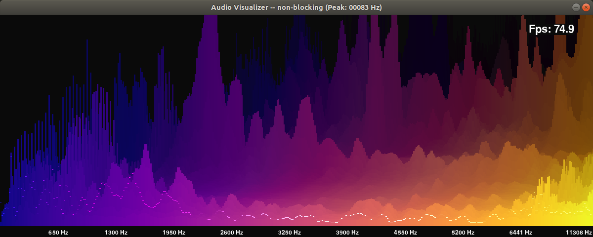
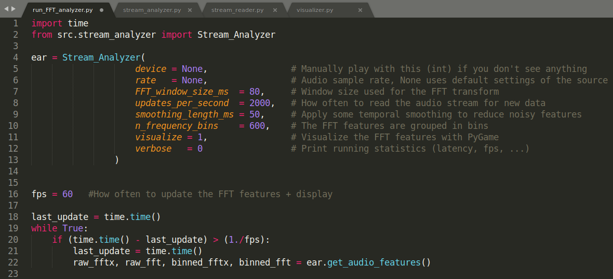

# Realtime_PyAudio_FFT

## A simple package to do realtime audio analysis in native Python, using PyAudio and Numpy to extract and visualize FFT features from live audio stream.

**The basic pipeline:**
* Starts a stream_reader that pulls live audio data from any source (soundcard, microphone, ...)
* Reads data from this stream many times per second (eg 1000 updates per second) and stores that data in a fifo buffer
* When called, the stream_analyzer, applies FFT to the latest audio segment
* When enabled, the visualizer displays these FFT features in realtime

**Uses:**
* I personally have learned **A LOT** about sound by watching this realtime visualization while listening to music
* You can run the stream_analyzer in headless mode and use the FFT features in any Python Application that requires live music features

**Requirements:**
* Tested on Ubuntu 18.04
* Other platforms like Mac/Windows should work if PyGame can find your display (can be tricky with WSL)

Tested with:
* pygame  --> Version: 1.9.6
* pyaudio --> Version: 0.2.11
* scipy   --> Version: 1.4.1

**ToDo:**
* Implement realtime beat detection / melody extraction on top of FFT features (eg using Harmonic/Percussive decomposition)
